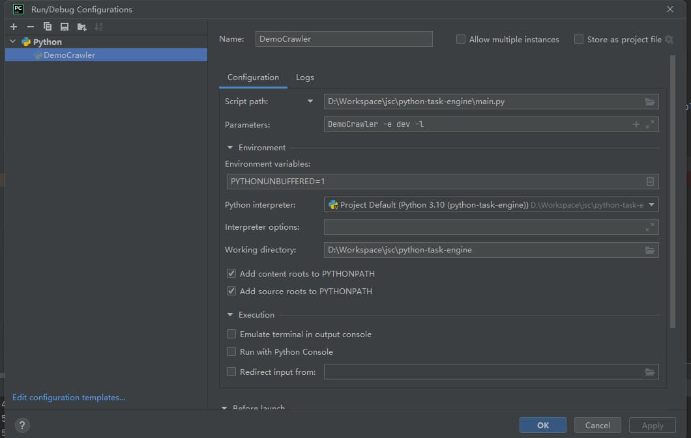

# python-task-engine

#### 介绍

封装的python脚本调度框架

#### 软件架构

软件架构说明

#### 安装教程

```bash
# 下载源码
git clone https://github.com/liuyueyi/python-task-engine.git

# 创建虚拟环境
python3.7 -m venv venv

# 安装依赖
venv/bin/pip install -r requirements.txt
```

#### 使用说明

pycharm启动方式配置:



启动命令如下:

```bash
venv/bin/python3 main.py DemoCrawler -e dev -l
```

参数说明:

- 第一个指定执行的python环境，当前目录下测试时，使用相对路径，crontab调度时，写绝对路径
- `main.py` 为固定的程序入口，同样crontab中写绝对路径
- `DemoCrawler` 需要调度的任务名，也就是具体的业务脚本的类名，要求类名与文件名一致
- `-e dev` 环境指定，dev线下， pro 线上
- `-l` 可以省略，表示将日志文件的内容同步打印到控制台，在测试时使用


正式上线，`crontab` 使用姿势

```bash
# 首先进入crontab
crontab -e

# 编写调度任务
# 每分钟执行一次 DemoCrawler.py 任务
*/1 * * * * /home/yihui/workspace/spider/venv/bin/python3.6 /home/yihui/workspace/spider/main.py DemoCrawler -e dev
```


通过任务启动日志判断执行状况，如没有特别指定输出的日志文件名，则任务日志文件与任务名一致，如下

```bash
less logs/DemoCrawler/DemoCrawler/DemoCrawler.log
```

pycharm debug测试

```bash
# DemoCrawler脚本执行case

Python 执行器
Script Path:  /Users/user/Project/GitHub/python-task-engine/main.py
Parameter: DemoCrawler -e dev -l
```